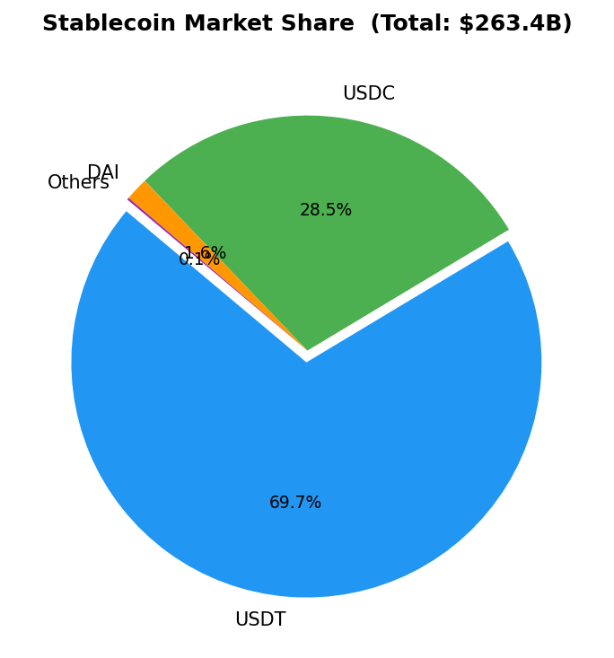

# 핀테크/디지털자산 주간 브리핑 — 2026-03-02

## 1. 거시경제 스냅샷
| 지표 | 값 |
|------|-----|
| Fed Funds Rate | 3.64% |
| 미국 10Y 국채 | 4.02% |
| USD/KRW | 1445.97 |

## 2. 디지털자산 시장
| 항목 | 값 | 7일 변화 |
|------|-----|---------|
| 스테이블코인 전체 시총 | $263.4B | — |
| USDT | $183.7B | +0.0% |
| USDC | $75.2B | -0.0% |
| BTC | $66,818 | +3.2% (24h) |

## 3. 이번 주 핵심 동향

**U.S. Passes GENIUS Act Reducing Stablecoin Regulatory Uncertainty**
The GENIUS Act has significantly reduced regulatory uncertainty for stablecoins, encouraging financial institutions and brands to issue new stablecoins for yield generation on customer funds.

**Federal Reserve Considers Master Accounts for Fintechs and Stablecoin Issuers**
The Federal Reserve is exploring limited master accounts for innovative payment firms, including stablecoin issuers, to enable direct access to U.S. payment rails amid expanding digital asset activities.

**EU MiCA Enforcement and Stablecoin Trends Shape 2026 Digital Assets Landscape**
In the EU, MiCA is actively enforced with tax regimes like DAC8/CARF starting data capture, positioning stablecoins as key rails for tokenization, DeFi, and various asset classes moving to production.

## 4. 투자 시사점

- ko: **스테이블코인 발행 확대**: GENIUS Act로 규제 불확실성 감소, 은행 및 핀테크의 신규 스테이블코인 출시 증가로 안정적 수익 창출 기회
- ko: **결제 인프라 접근성 강화**: 연준의 마스터 계좌 도입 검토로 핀테크·스테이블코인 업체의 글로벌 결제 네트워크 직접 연결, 거래 효율성 제고
- ko: **토큰화 및 DeFi 성장**: MiCA 시행과 스테이블코인 기반 자산 토큰화 본격화로 투자 다각화 및 수익 전략 확대, 기관 채택 가속화

---
*Generated: 2026-03-02T01:03:21.809321 | Source: FRED, CoinGecko, Perplexity*