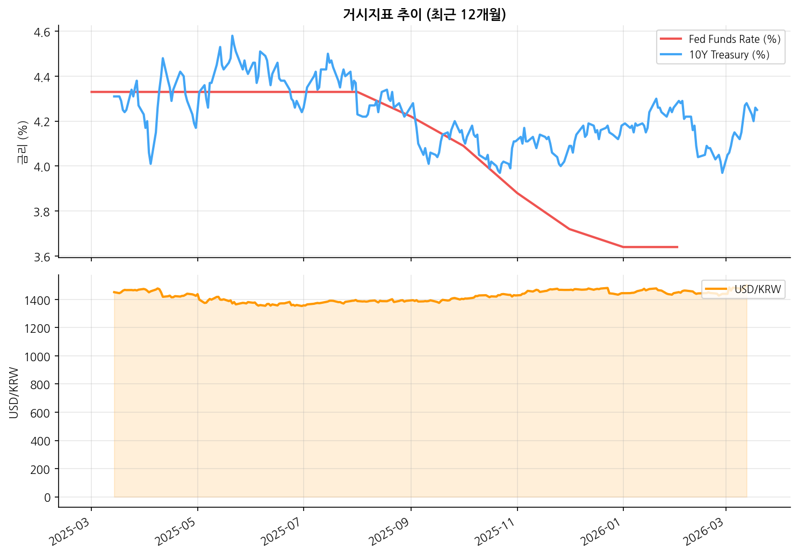
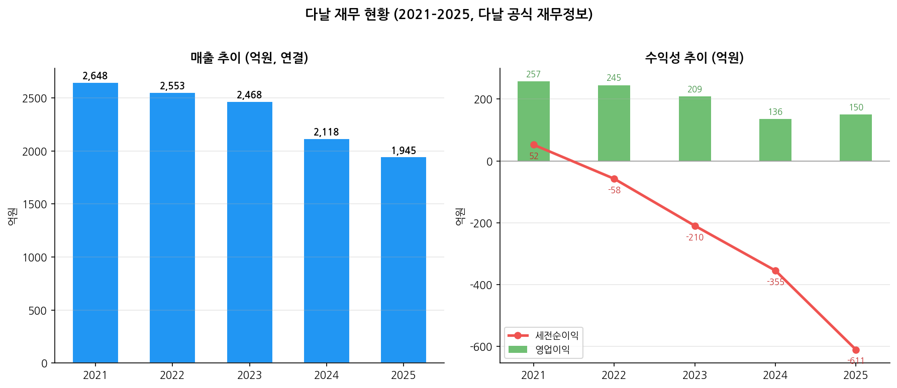

# 스테이블코인 시장 심화 분석 — 2026-03-21

> 현재 레짐: **Goldilocks** (High) | 스테이블코인 시총: $267.9B

---

## 1. 거시지표 추이

| 지표 | 현재 | 레짐 신호 |
|------|------|---------|
| Fed Funds Rate | 3.64% | 금리 하락 기조 — SC 결제 볼륨 ↑, 이자 수익 ↓ |
| 10Y Treasury | 4.25% | 장기금리 안정 — 기업 투자 환경 양호 |
| USD/KRW | 1498.88 | 달러 강세 프록시 — 크립토·이머징 자금 흐름 참고 |

---

## 2. 스테이블코인 시장 구조

| 코인 | 시총 | 도미넌스 | 수익 모델 | 규제 상태 |
|------|------|---------|---------|---------|
| USDT | $184.2B | ~70% | 이자 수익 (T-Bills) | 미규제 — GENIUS Act 적용 대상 |
| USDC | $79.0B | ~29% | 이자 수익 + CPN 수수료 | SEC 등록, OCC 인가 추진 |
| DAI | $4.2B | ~1.6% | 담보 이자 (DSR) | DeFi — MiCA 해당 없음 |
| RLUSD | 출시 초기 | <0.1% | ODL 수수료 + 이자 | NYDFS 인가 |

**구조적 특징:**
- **이자 의존 모델의 한계**: USDT/USDC 모두 수익의 90%+ 가 준비금 이자. Fed 금리 1%p 인하 시 Circle 연 $4.4억 매출 감소 (S-1 기준)
- **수수료 모델로의 전환**: Circle CPN ($5.7B 연간 볼륨), Ripple ODL — 거래 기반 수익 구조 시도
- **수수료 기반 모델**: 이자가 아닌 **정산 수수료(take rate) 기반 SaaS** — 금리 변동에 구조적으로 중립

---

## 3. 규제 환경 비교

| 관할 | 법안/규제 | 현황 | 다날 함의 |
|------|---------|------|---------|
| 미국 | GENIUS Act | 2025-07 통과 | USDC 정산 레일 안정성 ↑ — 규제 명확화로 기관 채택 가속 |
| 미국 | SEC 가이던스 | 증권성 판단 기준 진화 중 | 이자 지급 SC(DAI 등)의 증권 분류 리스크 지속 |
| EU | MiCA | 2024-06 시행, EBA 면제 종료 (2026-03-02) | 유럽 SC 발행 진입장벽 ↑ — USDC 유럽 시장 점유 기회 |

---

## 4. 다날 재무 현황

| 연도 | 매출 | 영업이익 | 세전순이익 | 해석 |
|------|------|---------|----------|------|
| 2021 | 2,648억 | 257억 | 52억 |  |
| 2022 | 2,553억 | 245억 | -58억 |  |
| 2023 | 2,468억 | 209억 | -210억 |  |
| 2024 | 2,118억 | 136억 | -355억 | 매출 하락 가속, 효율화 시작 |
| 2025 | 1,945억 | 150억 | -611억 | 영업이익 반등, 블록체인 투자 적자 확대 |

**핵심 긴장**: 본업 PG는 영업이익률 개선(6.4%→7.7%)으로 방어 중이나, 블록체인 투자 영업외손실 누적으로 세전순이익 적자 3배 확대. 신사업 수익화 시점이 투자 판단의 핵심.

---

## 5. 리서치 대상 스크리닝

| 기업 | 전략적합(40) | 기술보완(30) | 규제역량(20) | 협력가능(10) | **합계** | 판정 |
|------|-----------|-----------|-----------|-----------|--------|------|
| Circle | 38 | 28 | 19 | 8 | **93** | 파트너십 검토 |
| Ripple | 32 | 27 | 17 | 7 | **83** | 관심→IPO 후 검토 |
| 슈퍼블록 | 30 | 25 | 14 | 10 | **79** | 후속 모니터링 |
| Tether | 10 | 15 | 5 | 3 | **33** | 탈락 |
| Coinbase | 12 | 20 | 12 | 2 | **46** | 탈락 |
| 람다256 | 8 | 18 | 10 | 2 | **38** | 탈락 |
| 카이아 | 10 | 15 | 8 | 3 | **36** | 탈락 |

**기준**: 다날 전략적합성(40%) + 기술보완성(30%) + 규제역량(20%) + 협력가능성(10%)

---

## 6. 투자 시사점

- **레짐 Goldilocks에서의 최적 행동**: Growth 단계($267.9B) — USDC 정산 SaaS 파트너십 확장 최적 타이밍
- **결제 캐시카우**: 소비 안정 구간 — 결제 거래량 방어 가능
- **크로스보더 확장**: 크로스보더 결제 확장 여건 양호 — 파트너십 가속

**watch point:**
- GENIUS Act 시행 세부규정 확정
- Circle CCTP 정산 볼륨 추이
- USDC 도미넌스 변화 (USDT 대비)

---
*작성: 2026-03-21 | Source: FRED, CoinGecko, SEC EDGAR, 다날 공식(IR 북·보도자료·재무정보)*