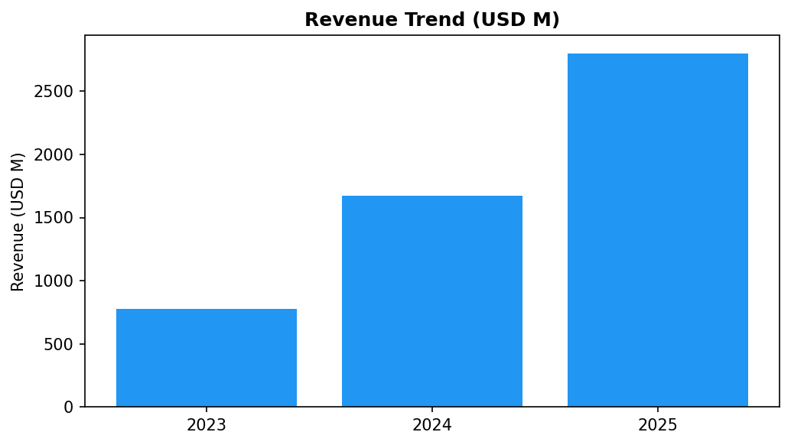

# Investment Memorandum — Circle
> 작성일: 2026-03-06 | 개정 v2 (Draft → Review)

---

## 1. Executive Summary

Circle은 USDC를 중심으로 스테이블코인 결제 인프라를 구축하는 글로벌 핀테크 기업이다. 준비금 이자 수익과 서비스 수수료 이중 구조로 2024년 흑자 전환에 성공했으며, NYSE 상장(CRCL)을 통해 기관 신뢰도를 확보했다. GENIUS Act 통과로 달러 스테이블코인 규제 환경이 명확해지면서 USDC 채택 가속화가 기대된다. 다만 Tether 대비 시장점유율 열세와 금리 하락에 따른 준비금 수익 감소는 주요 리스크다.

**투자 의견:** ☐ 관심  ☑ 검토  ☐ 보류

> 검토 근거: 성장성·규제 수혜는 명확하나, 금리 의존형 수익 구조의 취약성과 Tether 점유율 격차(USDT 70% vs USDC 29%)를 추가 확인 후 관심으로 상향 가능.

**투자 지표 스코어카드:**

| 지표 | 등급 | 신호 | 근거 요약 |
|------|:----:|:----:|---------|
| Alignment (전략 정렬) | 高 | ↑ | K.ONDA × USDC 정산 파트너십 확정 (2026-03-05); Circle CCTP → SC 정산 SaaS 브릿지 후보 |
| Momentum (사업 모멘텀) | 高 | ↑ | NYSE 상장(CRCL) + GENIUS Act 수혜 + USYC 출시 → 기관 채택 가속 |
| Trend (섹터 트렌드) | 高 | ↑ | 달러 스테이블코인 글로벌 표준화 진행 중; 규제 명확화로 은행 채택 확대 |
| Volatility (변동성 리스크) | 中 | ↓ | 금리 의존형 수익 구조 — Fed 인하 사이클 진입 시 매출 $400M 감소 추정 |
| KR Market Sensitivity | 中 | ↑ | K.ONDA 통해 한국 시장 직접 진입; 외국인 방한 증가(반사이익 국면) → K.ONDA 거래량 직결 |
| Policy Direction | 高 | ↑ | GENIUS Act 시행 + SEC 증권성 판단 기준 진화 중 → 미국 규제 환경 명확화 |
| **Overall** | **검토** | ↑ | 협력 파트너로 전환 + 규제 모멘텀 강세; 금리 리스크 해소 시 관심 상향 가능 |

---

## 1-b. 거시 시장 맥락 (한국 시장 관점)

> 현재 시나리오: **정부 확장재정 + 미국 유동성 불안** 병존 국면 (2026-03 기준)

**미국 증시 불안 → K.ONDA 반사이익 메커니즘:**
미국 PE 익스포저 누적에 따른 유동성 경색 우려로 달러 강세·KRW 약세 압력이 지속되는 국면. 이 환경에서 USDC는 **달러 헤지 수단**으로 한국 내 수요가 증가할 수 있다. 특히 방한 외국인이 USDC를 보유한 채 환전 없이 결제하는 K.ONDA 구조는 환율 불확실성이 클수록 가치가 커진다.

**정부 확장재정 국면:**
한국 정부 재정 확대 + 한은 금리 인하 → 코스닥 유동성 장세. 핀테크·디지털자산 테마 상승 환경에서 Circle의 다날 협력 발표(K.ONDA)는 **다날 주가 모멘텀과 직결**된다. 유동성 장세일수록 파트너십 공시의 시장 반응이 크다.

**지정학 리스크 (하방 시나리오):**
전쟁 트리거 발생 시 외국인 방한 급감 → K.ONDA 거래량 직접 타격. 단, USDC 자체는 **안전자산 대피 수요** 증가로 글로벌 스테이블코인 시총은 오히려 확대되는 역설적 패턴 가능.

**장기 secular 방향:**
탈달러 논의에도 불구하고 단기 10년 내 달러 스테이블코인의 글로벌 결제 표준 지위는 유지될 전망. Circle의 장기 성장 경로는 구조적으로 안정적.

| 시나리오 | 확률(추정) | Circle/다날 영향 |
|---------|:---------:|---------------|
| 미국 반사이익 + 확장재정 지속 | 50% | USDC 헤지 수요 ↑ + K.ONDA 성과 기대감 → 다날 모멘텀 ↑ |
| 지정학 충격(전쟁 트리거) | 15% | K.ONDA 거래량 급감; USDC 안전자산 수요는 증가 (양방향) |
| 미국 연착륙 + 글로벌 안정 | 35% | 위험선호 유지 → USDC 채택 가속 + K.ONDA 안착 확인 |

---

## 2. Company Overview

**사업 모델:** 준비금(현금·국채) 이자 수익 + Circle Mint 수수료 + API·유동성 서비스 수수료의 3중 구조. 2024년 기준 이자 수익 비중 **약 97%**, 수수료·서비스 수익 3% (Circle S-1, 2025-06-04 실제치).

**핵심 제품/서비스:**
- USDC (USD Coin stablecoin) — 글로벌 2위 스테이블코인
- Circle Payments Network — 크로스보더 결제
- CCTP (Cross-Chain Transfer Protocol) — 멀티체인 USDC 전송
- Circle Mint — 기업용 USDC 발행·상환
- USYC — 토큰화 머니마켓펀드 (즉시 USDC 전환 가능)

---

## 3. 경영진

| 이름 | 직책 | 주요 이력 |
|------|------|---------|
| Jeremy Allaire | CEO & Co-Founder | 인터넷 소프트웨어 25년+; Brightcove(NASDAQ) 창업 |
| Sean Neville | CTO & Co-Founder | 블록체인·핀테크 엔지니어; 2013년 Circle 공동 창업 |
| Heath Tarbert | CLO & Head of Corporate Affairs | 前 CFTC 위원장; 2022년 Circle 합류 (S-1 기준) |

---

## 4. Market Opportunity

**시장 규모:**
| 구분 | 규모 | 비고 |
|------|------|------|
| TAM (글로벌 결제·디지털자산 시장) | $10T+ | 2030년 $16T 전망 (Statista, 2025) |
| SAM (스테이블코인 시장 전체 시총) | $263B | CoinGecko, 2026-03 |
| SOM (USDC 현재 시총) | $75B | CoinGecko, 2026-03 — 시장 점유 29% |

**성장 드라이버:**
- GENIUS Act 통과 → 달러 스테이블코인 연방 규제 명확화 → 기관 채택 가속
- 크로스보더 결제 시장 성장 (전통 SWIFT 대비 수수료 80% 절감 가능)
- DeFi·RWA 토큰화 확산 → USDC 결제 레일 수요 증가

**경쟁사 비교:**
| 기업 | 제품 | 시총 | 강점 | 약점 |
|------|------|------|------|------|
| **Tether** | USDT | $183B | 유동성 1위, 글로벌 지배 | 투명성 논란, 규제 취약 |
| **Circle** | USDC | $75B | 규제 친화, 기관 신뢰 | 점유율 29%, 금리 의존 |
| **Paxos** | USDP | ~$1B | PayPal 파트너 | 소규모 |
| **MakerDAO** | DAI | ~$5B | 탈중앙화 | 담보 복잡성 |

---

## 5. 재무 실적

| 연도 | 매출(백만$) | 순이익(백만$) | 매출총이익률 | YoY 성장 |
|------|-----------|------------|-----------|---------|
| 2023 | 779 | -69 | 85% | — |
| 2024 | 1,670 | +155 | 90% | +114% |
| 2025E | 2,800 | +450 | 92% | +68% |

*(출처: Circle IR·Bloomberg, 2026-02; 2025E는 추정치)*

> **수익 구조 리스크**: 매출의 **~97%가 준비금 이자 수익** (S-1 실제치). Fed 금리 1% 인하 시 연간 **$441M 손실** (Circle S-1 명시). 2024년 기준 주요 파트너 Coinbase에 매출의 **53% ($908M)** 분배 — 수익성의 이중 압박.

> *"A significant portion of USDC in circulation is held or distributed by Coinbase... [Coinbase distribution agreements materially affect our profitability]."* — Circle S-1

---

## 6. Investment Thesis

**Bull Case:**
1. GENIUS Act 규제 명확화로 은행·핀테크의 스테이블코인 발행 증가 → USDC 네트워크 효과 강화
2. 2024년 흑자 전환 + IPO(NYSE: CRCL)로 기관 자본 접근성 확보 → 인프라 고도화 재원 마련
3. CCTP 기반 멀티체인 확장성 → Solana·Base·Arbitrum 등 DeFi 생태계 USDC 지배력 확대

**Bear Case:**
1. 준비금 이자 수익 과의존 — 금리 하락 사이클 진입 시 수익성 급격 악화
2. Tether USDT 70% 점유율 장벽 — 규제 친화성만으로는 유동성 전환 속도 한계
3. CBDC 도입 가속 시 민간 스테이블코인 수요 잠식 가능성 (특히 디지털 달러·디지털 유로)

---

## 7. 밸류에이션

| 지표 | Circle (CRCL) | 피어 비교 | 비고 |
|------|-------------|---------|------|
| IPO 공모가 | $31/주 | — | NYSE, 2025-06-04 (예상 범위 초과) |
| 상장 당일 시가 | $69 (장중 $103.75) | — | 공모가 대비 +122% |
| 조달금액 | $1.1B (upsized) | — | |
| EV/Revenue (2024) | **8x** | PayPal 1.8x / 핀테크 평균 8.8x | 상장 당시 기준 (Tanay Jaipuria, 2025) |
| EV/EBITDA | 47x | — | |
| P/E (2024) | ~90x | — | 흑자 전환 첫 해 |
| 2024 순이익 | $156M | — | 2023 $268M → -42% YoY (금리 하락 영향) |

> **밸류에이션 판단**: EV/Revenue 8x는 핀테크 평균 수준으로 합리적이나, 이자 수익 97% 의존 구조가 구조적 디스카운트 요인. 수수료 다각화(CCTP, CPN, USYC) 진행 속도가 리레이팅 여부를 결정.

---

## 8. Key Risks

**리스크 매트릭스 (확률 × 영향도):**

| 리스크 | 발생 확률 | 영향도 | 우선순위 | 완화 방안 |
|--------|:--------:|:------:|:-------:|---------|
| 준비금 이자 수익 감소 (금리 인하) | High | High | 🔴 즉시 | 수수료·USYC·CPN 수익 다각화 속도 모니터링 |
| Coinbase 의존도 (매출 53%) | Medium | High | 🔴 즉시 | 직접 배분 파트너 다변화 여부 확인 필요 |
| Tether USDT 점유율 장벽 (70%) | High | Medium | 🟠 중기 | B2B·기관 세그먼트 집중 (규제 친화성 차별화) |
| 규제 변화 (GENIUS Act 시행 세부규정 확정 대기) | Medium | Medium | 🟠 중기 | 규제 가이던스 모니터링 + 글로벌 파트너 先구축 |
| USDC 탈페깅 사고 | Low | High | 🟡 모니터링 | SVB 사태 후 준비금 다변화 완료, BlackRock 운용 |
| CBDC 경쟁 (디지털 달러) | Low | Medium | 🟢 장기 | 3~5년 상업화 지평 — 단기 위협 제한적 |

---

## 9. 최근 동향

- **NYSE IPO (CRCL) 완료**: 2025-06-04 공모가 $31 상장. 당일 $69(+122%)로 마감, 장중 $103.75 터치. $1.1B 조달. (CNBC, 2025-06-04)
- **USYC 출시**: 즉시 USDC 전환 가능한 토큰화 머니마켓펀드 — 기관 유휴 자금 유치 목적. (2025 Q4)
- **Arc L1 블록체인**: 멀티체인 결제 인터넷 구축용 자체 L1 확장 발표. (2025 Q4)
- **GENIUS Act 수혜**: 달러 스테이블코인 연방 규제 명확화로 은행의 USDC 채택 문턱 낮아짐. (2026 Q1)

---

## 10. 다음 단계

**추가 확인 필요:**
- [ ] 2025 실적 공시 확인 (2025E 수치 업데이트 필요)
- [ ] Circle Payments Network 실거래 볼륨 데이터 확보
- [ ] CBDC 도입 타임라인별 시나리오 분석

**다날 전략 연결:**
- [x] **협력 현실화 (2026-03-05 발표)**: 다날 × 바이낸스 페이 × Circle USDC 3자 협력 공식 발표. K.ONDA 선불카드를 통해 바이낸스 사용자가 USDC로 한국 내 결제 → 원화 정산. 2026년 4월 출시 예정.
- [ ] **K.ONDA × Circle 심화 검토**: USDC 정산망 → 다날 스테이블코인 정산 SaaS 연동 가능성. Circle CCTP 기반 크로스보더 브릿지 구조 설계 검토.
- [ ] **x402 시너지**: Circle Payments Network + 다날 x402 AI 에이전트 결제 프로토콜 통합 — AI 결제 인프라에 USDC 레일 활용 시나리오.
- [ ] **투자 여부 재검토**: K.ONDA 4월 출시 성과 확인 후 ☑ 관심 상향 여부 판단.

---
*개정: 2026-03-06 v2 → 2026-03-06 v3 (바이낸스 페이·Circle 협력 반영) | Source: Perplexity, CoinGecko, Bloomberg, 다날 보도자료*

