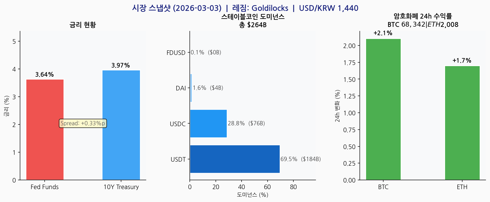

# 스테이블코인 섹터 스크리닝 — 2026-03-06

> **이번 주 핵심**: 현재 레짐 **Goldilocks** — GENIUS Act 수혜 본격화, 스테이블코인 시총 $263B 안정. 다날 KRW SaaS 진입 타이밍 매력도 ↑

---

## 1. 거시 레짐 판단

| 판단 | 확신 | 근거 지표 |
|------|------|---------|
| **Goldilocks** | Medium | Fed Funds 3.64% (하락 기조) + 10Y-FF 스프레드 +0.38%p (정상화) + BTC +3.2% |

**레짐 → 스테이블코인 함의**: Goldilocks = 위험선호 + 금리 안정 → 스테이블코인 준비금 수익 유지 + 결제 채택 확대 동시 진행. 스테이블코인 SaaS 사업 확장에 최적 환경.

---

## 2. 거시경제 스냅샷

| 지표 | 값 | 신호 |
|------|----|----|
| Fed Funds Rate | 3.64% | 하락 기조 — 수수료 모델에 중립 |
| 미국 10Y 국채 | 3.97% | 장기금리 안정 |
| USD/KRW | 1,439.82 | 원화 약세 — KRW SaaS 수출 유리 |

*\*거시지표는 당일 수집 시각 기준 — brief 리포트 등 동일 날짜 산출물과 소폭 차이 발생 가능*

---

## 3. 스테이블코인 시장

**전체 시총: $264.2B** — 신호: `NEUTRAL (안정권)`

| 코인 | 발행사 | 시총 | 도미넌스 | 7일 변화 |
|------|------|------|---------|---------|
| USDT | Tether | $183.6B | 69.5% | +0.0% |
| USDC | Circle | $76.0B | 28.8% | +0.0% |
| DAI | MakerDAO | $4.2B | 1.6% | +0.1% |
| FDUSD | First Digital | $0.4B | 0.1% | +0.0% |

---

## 4. 규제 프레임워크 현황

| 규제 | 지역 | 상태 | 다날 영향 |
|------|------|------|---------|
| **GENIUS Act** | 미국 | ✅ 통과 | 달러 스테이블코인 연방 기준 → KRW SaaS 글로벌 표준 형성 선례 |
| **MiCA** | EU | ✅ 시행 중 | EMT 인허가 기준 구체화 → 해외 진출 준거 |
| **디지털자산기본법** | 한국 | 🔄 시행령 조율 중 | KRW 스테이블코인 정의 미확정 — 직접 영향 |
| **연준 마스터계좌** | 미국 | 🔄 검토 중 | 스테이블코인 결제 인프라 접근성 개선 가능성 |

---

## 5. 글로벌 경쟁사 맵

| 구분 | 기업 | 강점 | 약점 | 다날 비교 |
|------|------|------|------|---------|
| **달러 발행사** | Tether (USDT) | 유동성 1위, 거래소 지배 | 투명성 논란 | 달러 경쟁 아님 — 원화 특화 |
| **달러 발행사** | Circle (USDC) | 규제 친화, 기관 신뢰 | 금리 의존, 점유율 29% | 협력 가능 (CCTP 연동) |
| **인프라** | Stripe | 가맹점 170만+, USDC 결제 | 발행 없음 | 가맹점 네트워크 벤치마킹 |
| **국내 결제** | 카카오페이 | 간편결제 UX, 4천만 사용자 | 스테이블코인 인프라 없음 | UX 경쟁, 인프라 차별화 |
| **국내 결제** | 토스 | 젊은 층 기반, 금융 슈퍼앱 | 기업용 SaaS 미약 | B2B SaaS 차별화 |
| **다날** | KRW SaaS | 결제 인프라 × 발행 수직통합 | 인지도·시장점유율 초기 | **유일한 원화 수직통합** |

---

## 6. 다날 포지셔닝 분석

> **핵심 차별화**: 결제 인프라(기존 캐시카우) × 스테이블코인 발행(신규) 수직 통합.
> 글로벌 경쟁사는 발행(Circle·Tether)이나 인프라(Stripe)만 보유 — 다날은 유일한 원화 수직통합.

### Goldilocks 레짐에서의 다날 3축 함의

| 사업 축 | 현재 환경 영향 | 단기 행동 권고 |
|---------|------------|-------------|
| 캐시카우 (휴대폰결제) | 소비 확장 → 거래량 증가 예상 | 현 포지션 유지, 수익 모니터링 |
| 성장동력 (KRW SaaS) | Goldilocks = SaaS 신규 계약 공략 최적 타이밍 | 기업 파일럿 프로그램 가속화 검토 |
| 미래 (x402·PCI) | 위험선호 환경 → AI 결제 실험 투자 우호적 | x402 파트너십 라인업 검토 |

---

## 7. 투자 기회 & 리스크 매트릭스

| 구분 | 내용 | 강도 |
|------|------|------|
| ✅ 기회 1 | GENIUS Act → 기관 스테이블코인 도입 가속 → KRW SaaS B2B 수요 증가 | ⭐⭐⭐ |
| ✅ 기회 2 | Goldilocks 레짐 지속 → 성장 환경 최적, 신규 계약 공략 타이밍 | ⭐⭐⭐ |
| ✅ 기회 3 | 원화 약세(1,440 수준) → KRW SaaS 글로벌 결제 수출 경쟁력 ↑ | ⭐⭐ |
| ⚠️ 리스크 1 | 한국 디지털자산기본법 세부 규정 미확정 → KRW 스테이블코인 법적 지위 불확실 | ⭐⭐⭐ |
| ⚠️ 리스크 2 | USDT 도미넌스 69.5% 집중 → 원화 스테이블코인 채택 동인 약화 우려 | ⭐⭐ |
| ⚠️ 리스크 3 | 금리 하락 본격화 → 준비금 이자 수익 모델 업종 전반 압박 | ⭐⭐ |

---
*생성: 2026-03-06 | Source: FRED, CoinGecko, Perplexity | 레짐: Goldilocks*
