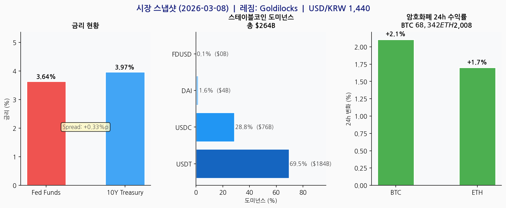
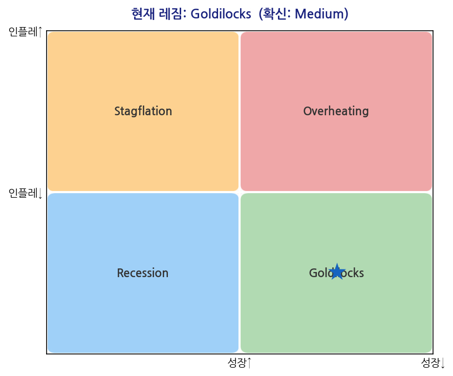
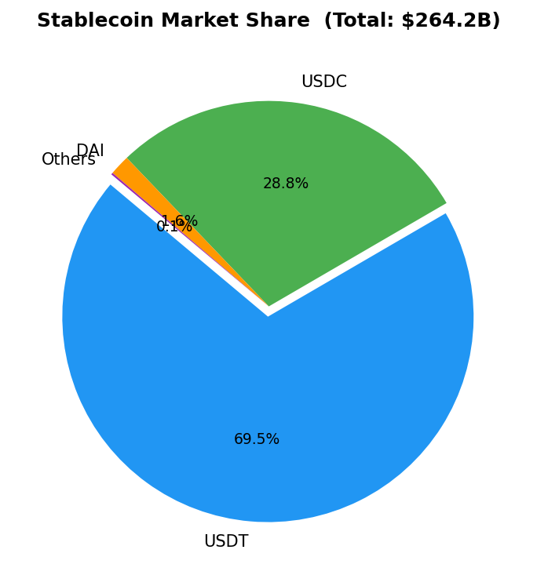

# 스테이블코인 섹터 스크리닝 — 2026-03-08

---

## 1. 거시 레짐

| 판단 | 확신 | 성장 방향 | 인플레이션 |
|------|------|---------|-----------|
| **Goldilocks** | Medium | positive | moderate |

**근거:**
  - 수익률 곡선 정상화 (10Y-FF spread: +0.33%p) → 성장 기대
  - Fed Funds 3.64% — 완만한 긴축 (인플레이션 moderate)

## 2. 거시경제 스냅샷

| 지표 | 값 |
|------|-----|
| Fed Funds Rate | 3.64% |
| 미국 10Y 국채 | 3.97% |
| USD/KRW | 1439.82 |

## 3. 스테이블코인 시장

**전체 시총: $264.2B** — 시그널: `NEUTRAL`
> 시총 $264.2B — 안정권

| 코인 | 시총 | 도미넌스 | 7일 변화 |
|------|------|---------|---------|
| USDT | $183.6B | 69.5% | +0.0% |
| USDC | $76.0B | 28.8% | +0.0% |
| DAI | $4.2B | 1.6% | +0.1% |
| FDUSD | $0.4B | 0.1% | +0.0% |

## 4. 다날 비즈니스 함의

**레짐 Goldilocks 기준:**

- **KRW 스테이블코인 SaaS**: 성장 환경 최적 — 기업의 스테이블코인 결제 도입 수요 증가. SaaS 신규 계약 공략 타이밍.
- **휴대폰결제 캐시카우**: 소비 확장 국면 → 휴대폰결제 거래량 증가 예상. 캐시카우 수익 안정적.
- **글로벌 핀테크 확장**: 위험자산 선호 → 글로벌 핀테크 투자 활성화. 해외 파트너십 협상 유리.

**주목할 이벤트:**
- Fed 금리 동결/인하 확인
- 스테이블코인 신규 발행 동향
- MiCA 집행 현황

## 5. 투자 기회 & 리스크 매트릭스

| 구분 | 내용 |
|------|------|
| ✅ 기회 1 | 스테이블코인 규제 명확화(GENIUS Act) → SaaS 신규 수요 |
| ✅ 기회 2 | Goldilocks 레짐 → 성장 환경 최적 — 기업의 스테이블코인 결제 도입 수요 증가. SaaS ... |
| ✅ 기회 3 | PCI 편의점 결제 확장 — 경기 방어적 포지션 |
| ⚠️ 리스크 1 | USDT 도미넌스 69.5% 집중 → Circle 이탈 시 구조 변화 |
| ⚠️ 리스크 2 | USD/KRW 1439.82 — 환율 변동성 |
| ⚠️ 리스크 3 | 한국 디지털자산기본법 스테이블코인 정의 미확정 |

---
*Generated: 2026-03-08T01:04:30.305079 | Source: FRED, CoinGecko, Perplexity*