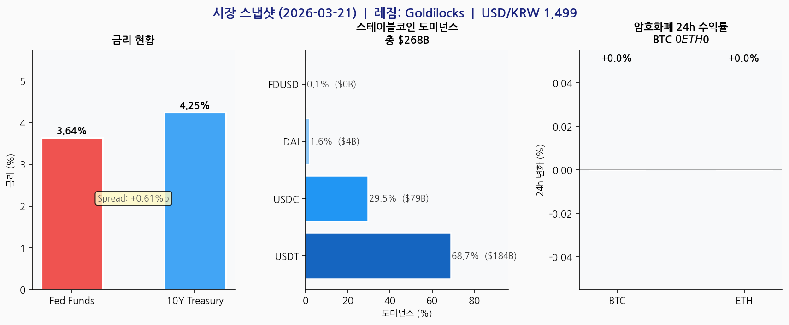
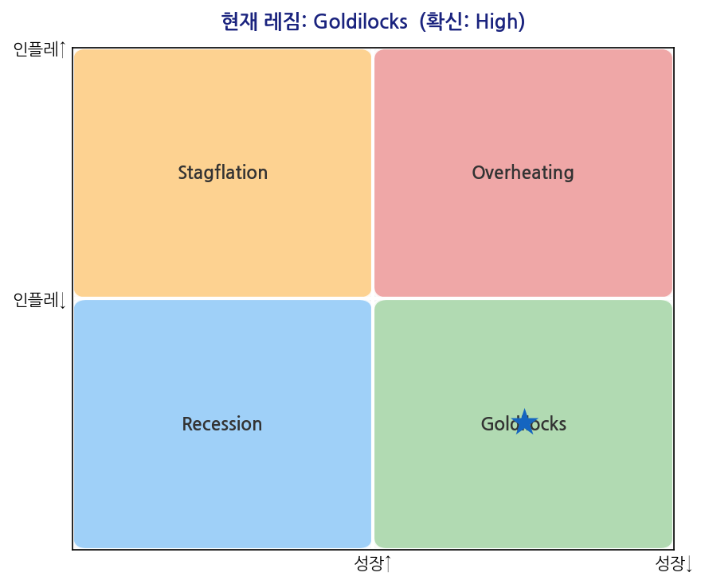
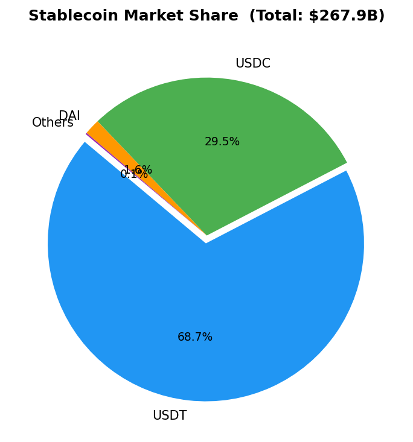

# 스테이블코인 섹터 스크리닝 — 2026-03-21

---

## 1. 거시 레짐

| 판단 | 확신 | 성장 방향 | 인플레이션 |
|------|------|---------|-----------|
| **Goldilocks** | High | positive | moderate |

**근거:**
  - 10Y-FF spread +0.61%p → 수익률 곡선 정상화, 경기 확장 기대
  - 2Y-10Y spread +0.46%p → 정상 곡선, 경기 확장 확인

## 2. 거시경제 스냅샷

| 지표 | 값 |
|------|-----|
| Fed Funds Rate | 3.64% |
| 미국 10Y 국채 | 4.25% |
| USD/KRW | 1498.88 |

## 3. 스테이블코인 시장

**전체 시총: $267.9B** — 시그널: `NEUTRAL`
> 시총 $267.9B — 안정권 유지

| 코인 | 시총 | 도미넌스 | 7일 변화 |
|------|------|---------|---------|
| USDT | $184.1B | 68.7% | -0.0% |
| USDC | $79.0B | 29.5% | -0.0% |
| DAI | $4.3B | 1.6% | -0.0% |
| FDUSD | $0.4B | 0.1% | -0.0% |

## 4. 다날 비즈니스 함의

**레짐 Goldilocks 기준:**

- **스테이블코인 정산 SaaS**: Growth 단계($267.9B) — USDC 정산 SaaS 파트너십 확장 최적 타이밍
- **결제 캐시카우**: 소비 안정 구간 — 결제 거래량 방어 가능
- **크로스보더 확장**: 크로스보더 결제 확장 여건 양호 — 파트너십 가속

**주목할 이벤트:**
- GENIUS Act 시행 세부규정 확정
- Circle CCTP 정산 볼륨 추이
- USDC 도미넌스 변화 (USDT 대비)

## 5. 투자 기회 & 리스크 매트릭스

| 구분 | 내용 |
|------|------|
| ✅ 기회 1 | 스테이블코인 규제 명확화(GENIUS Act) → SaaS 신규 수요 |
| ✅ 기회 2 | Goldilocks 레짐 → Growth 단계($267.9B) — USDC 정산 파트너십 확장 가속 |
| ✅ 기회 3 | 결제 인프라 확장 — 경기 방어적 포지션 |
| ⚠️ 리스크 1 | USDT 도미넌스 68.7% 집중 → Circle 이탈 시 구조 변화 |
| ⚠️ 리스크 2 | SEC 증권성 판단 — 이자 지급 SC 규제 불확실성 |
| ⚠️ 리스크 3 | Fed 금리 인하 시 준비금 이자 모델 수익성 압박 |

---
*작성: 2026-03-21 | Source: FRED, CoinGecko, 다날 공식(IR 북·보도자료·재무정보)*